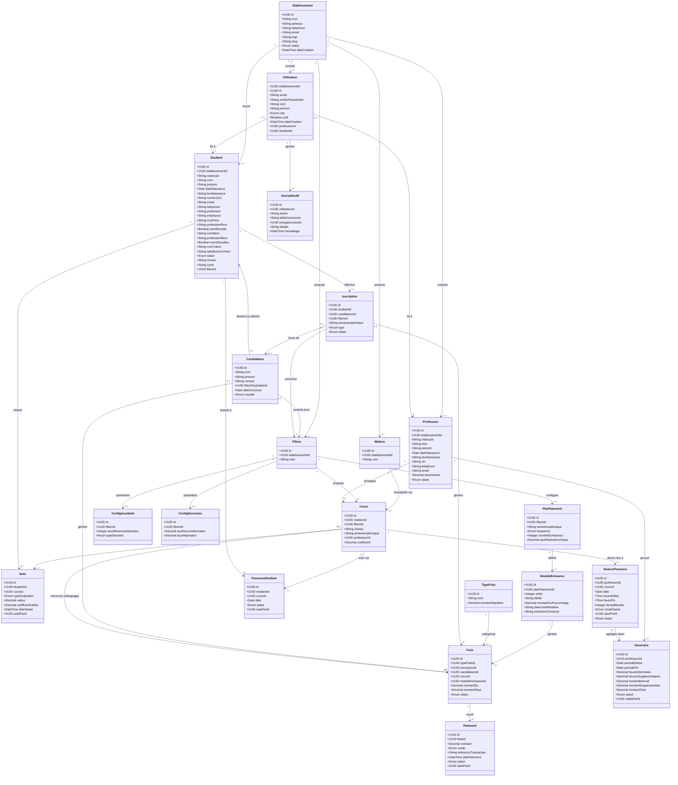

# Diagramme de Classe — ERP Universités Privées (MVP)

> **Note importante** : `id` est l'identifiant technique interne (clé primaire, généré par le système, jamais affiché). `matricule` est l'identifiant métier (visible, utilisé sur les documents officiels, saisi ou généré selon une règle propre à l'université). Ces deux champs sont **distincts** pour `Etudiant` et `Professeur`.

> **Changement d'architecture** : le système utilise désormais une base de données partagée entre toutes les universités (plutôt qu'une base dédiée par université). Chaque table métier porte un champ `etablissementId`, appliqué automatiquement par la couche d'accès aux données pour garantir l'isolation logique des données entre établissements.

---

## Dictionnaire rapide — champs `id` vs `matricule`

| Entité | `id` (technique) | `matricule` (métier) |
|---|---|---|
| **Etudiant** | UUID interne, jamais affiché, utilisé uniquement pour les relations en base | Identifiant lisible affiché sur les bulletins, cartes, documents officiels (ex: `ETU-2026-0347`) — propre au système de numérotation de chaque université |
| **Professeur** | UUID interne, jamais affiché | Identifiant lisible affiché sur les fiches de paie/honoraires (ex: `PROF-2026-012`) |

Ces deux champs ne sont **jamais confondus** dans les relations entre tables : toutes les clés étrangères (`etudiantId`, `professeurId`) pointent vers le champ `id`, jamais vers le `matricule`. Le `matricule` reste un attribut d'affichage, éventuellement modifiable en cas d'erreur de saisie, sans casser aucune relation en base.

---

*Diagramme généré à partir du modèle consolidé de la conversation, reflétant les simplifications MVP actées dans le document des règles de gestion.*
